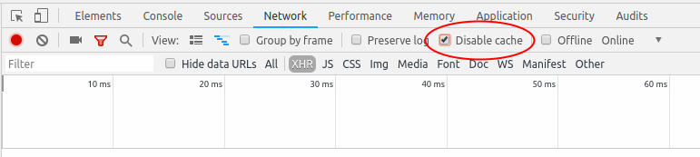

# Build your own Secure Messenger in 3 hours

## Introduction

This document is the workshop guide for [Ben Dechrai](https://bendechrai.com)'s workshop of the same name.

The workshop is split in to steps, to help break them in to specific goals. If you don't manage to complete one step, you can simply move on to a working version and continue the workshop.

For example, if you're working on step 3, and the group is ready to get started on step 4, simply change to the "step4" directory and use https://localhost:3004/ to get to a version that has steps 1 to 3 already completed.

## Pre-requisites

To take part in this workshop, you need to be comfortable using the command line terminal of your operating system, be able to clone a git repository, and have a basic understanding of PHP.

## Before the Workshop

Before you arrive at the workshop, you'll need to get your laptop prepared. This process can take a few hours or more, depending on your internet connection speed.

### Software Requirements

The workshop code is known to work in [Chromium](https://www.chromium.org/) and [Chrome](https://www.google.com.au/chrome/), and the sandbox development environment uses [VirtualBox](https://www.virtualbox.org/) and [Vagrant](https://www.vagrantup.com/). Please ensure you have one of these browsers installed, and at least VirtualBox 5.1.34 and Vagrant 1.9.1 runnig and working on your machine.

### Cloning this Repository

If you haven't yet, clone [`https://github.com/bendechrai/workshop-secure-messenger.git`](https://github.com/bendechrai/workshop-secure-messenger.git) using your favourite git client.

```bash
git clone --depth 1 https://github.com/bendechrai/workshop-secure-messenger.git
```

### Download the Vagrant box

Grab the Vagrant box image from [https://www.dropbox.com/s/10e5d70t7i52jhl/workshop-secure-messenger.box?dl=0](https://www.dropbox.com/s/10e5d70t7i52jhl/workshop-secure-messenger.box?dl=0) and save it in the root of the new git repository.

```bash
wget https://www.dropbox.com/s/10e5d70t7i52jhl/workshop-secure-messenger.box?dl=0
```

### Virtual Machine

This code repository contains a working Vagrant box, for ease of getting started. Once you've cloned the repository, head to your command line terminal, and run:

```bash
cd <path/to/workshop-secure-messenger>
vagrant box add workshop-secure-messenger.box --name workshop-secure-messenger
vagrant up
```

## At the Workshop

### Connecting to the virtual machine

**Username**: vagrant

**Password**: vagrant

When working on the files, you can edit them directly on your host machine. However, there are some things that must be done from within the virtual machine. To avoid issues, it's recommended you always do things in the virtual machine.

You can either connect to the machine from the VirtualBox management application, or from your command line:

```bash
// From anywhere in the workshop code base, run this:
vagrant ssh
```

If you have used SSH, you should see a screen with text similar to this:

```bash
Linux debian-9 4.9.0-6-amd64 #1 SMP Debian 4.9.88-1+deb9u1 (2018-05-07) x86_64

The programs included with the Debian GNU/Linux system are free software;
the exact distribution terms for each program are described in the
individual files in /usr/share/doc/*/copyright.

Debian GNU/Linux comes with ABSOLUTELY NO WARRANTY, to the extent
permitted by applicable law.
vagrant@debian-9:~$
```

If you connected via the VirtualBox application, you will see a black screen with the prompt:

```bash
debian-9 login:
```


### URLs and document roots for each step

Whenever you want to work on the workshop files within the Vagrant box, you'll have to change user to the web server first:

```bash
sudo su - www-data
```

Each of these steps is a starting milestone in this repo, and available at `https://localhost:xxxx/` where `xxxx` is the step number plus 3000. For example, if starting from step 3, participants can head to `https://localhost:3003/`.

Similarly, each step has it's own known-good document root, in the `/vagrant/docroots/stepX` folder, where `X` is the step number.

If you're looking for the document root on your host machine, they're in `/path/to/workshop-secure-messenger/docroots/stepX`.

The final, working code, is in `docroots/final`.

### Caching Issues

A lot of the code in this workshop is client-side JavaScript. As such, you might encounter cases where changes to to code don't seem to create the desired effect.

One way to ensure you don't have this issue, is to enable the developer tools in Chromium or Chrome, and select the Network tab, and turn on the "Disable Cache" option.



## Steps

To help keep participants on track, the workshop can be run from beginning to end in one step. Participants who need more time may elect to move on to a known working version of a subsequent step during the workshop, and revisit the details of each step in their own time at a later time.

These steps we'll follow in the workshop are:

0. Welcome and getting started (5 minutes),
1. Take a base Laravel install, and ensure passwords are hashed before sending to the server (10 minutes),
2. Create a contact list view for users,
3. Create a message model, a user controller and view, and allow users to see messages,
4. Add functionality to create new messages for someone,
5. Add [OpenPGP.js](https://github.com/openpgpjs/openpgpjs/) and generate a new keypair,
6. Create an endpoint to allow a user to get a contact's public key,
7. Encrypt the message before sending it to the server,
8. Decrypt encrypted messages,

## Step 1 - Double Hashing

By now, you should be able to see a base Laravel installation at `https://localhost:3001/`. Remember that we're using TLS encryption using a self-signed certificate, so if you see a certificate error, you'll need to manually proceed.

The first step in this workshop is to enable the user login system, and make sure passwords are hashed in the browser before being sent to the server. This way, we can ensure the server will never know your password, but still be able to log you in.

Laravel makes it really easy to add authentication. Firstly, we'll need to connect to the vagrant box.

### Enable Authentication Components

Now we're ready to add the authentication components:

```bash
php artisan make:auth
php artisan migrate
```

If you refresh the homepage now, you'll see the Login and Register links in the top right.

### Hash passwords in the browser

This will require some custom code. We're going to use JavaScript to hook in to the login and registration form, and hash passwords before the form is actually submitted.

The JavaScript in a Laravel application is kept in `resources/assets/js/app.js`. You can edit this file on your main machine if that's easier, using an editor of your choice.

Add something like this to that file:

```javascript
import AuthHash from './AuthHash';
// make sure that the page is completely loaded before we try looking for the form elements
$(document).ready(function () {
    var ah = new AuthHash($);
    ah.authHook();
});
```

Now create the `AuthHash` class (`resources/assets/js/Authash.js`) and the `authHook` method. Note the script above injects jQuery in to the constructor.

### Hints

You might want to add `id`s to the HTML form elements in `resources/views/auth/*.blade.php`

JavaScript doesn't have any native hashing functions. An easy to use library is easy to install with `npm` from the document root:

```bash
npm install bcryptjs
```

You can hash a string like this:

```javascript
bcrypt.hashSync(string, bcrypt_salt);
```

### Sample Solution

Feel free to just take this and put it straight in to your code. The aim of this workshop is to give you new tools and ways of thinking, not knowing the code off the top of your head.

We want to hook in to two forms, so let's give those forms IDs we can look for:

Edit `resources/views/auth/register.blade.php`, and add the ID `register` to the form element.

Edit `resources/views/auth/login.blade.php`, and add the ID `login` to the form element.

Then create the following AuthHash class in `resources/assets/js/AuthHash.js`:

```javascript
export default class AuthHash {

    constructor(jQuery) {
        this.jQuery = jQuery;
        this.bcrypt = require("bcryptjs");
    }

    authHook() {

        self = this;

        // On register submit, hash passwords
        this.jQuery("form#register").submit(function (e) {

            // Grab passwords
            var password = self.jQuery("#password", e.target).val();
            var passwordConfirm = self.jQuery("#password-confirm", e.target).val();

            // Hash the passwords, and put them in to the password fields
            self.jQuery("#password", e.target).val(self.bcrypt.hashSync(password, self.getSalt()));
            self.jQuery("#password-confirm", e.target).val(self.bcrypt.hashSync(passwordConfirm, self.getSalt()));

        });

        // On login submit, hash password
        this.jQuery("form#login").submit(function (e) {

            // Grab password
            var password = self.jQuery("#password", e.target).val();

            // Hash the password, and put it in to the password field
            self.jQuery("#password", e.target).val(self.bcrypt.hashSync(password, self.getSalt()));

        });

    }

    getSalt() {
        // Salt is 22 chars long. It shouldn't be public. Can you think of a way to avoid using a fixed string?
        var salt = "1234567890123456789012"
        salt = "$2y$10$" + salt;
        return salt;
    }

}
```

Note that Laravel uses compiled assets. You'll need to run

```bash
npm run dev
```

after changign any JS files. Alternatilvely, run this once in another tab, and changes to JS files will start an automatic rebuild:

```bash
npm run watch
```

## Step 2 - Contact Lists

Starting logged in, and looking at the dashboard, we want to create a view of contacts on the left, and a placeholder for messages on the right. For simplicity, the contact list will show a list of all users in the system. Note that this could represent a privacy leak in a production system.

Edit the `resources/views/home.blade.php` view, and `app/Http/Controllers/HomeController.php` controller accordingly.

### Sample Solution

#### View

```php
@extends('layouts.app')

@section('content')
<div class="container">
    <div class="row">
        <div class="col-md-4 contacts">
            <div class="panel panel-default">
                <div class="panel-heading">Contacts</div>
                <div class="panel-body">
                    <ul>
                        @foreach ($users as $_user)
                            <li><a href="">{{ $_user->name }}</a></li>
                        @endforeach
                    </ul>
                </div>
            </div>
        </div>
        <div class="col-md-8 messages">
            <div class="panel panel-default">
                <div class="panel-heading">Message</div>
                <div class="panel-body">
                    Select a user on the left to start chatting with them.
                </div>
            </div>
        </div>
    </div>
</div>
@endsection
```

### Controller

Add this to the list of classes to use:

```php
use App\User;
```

And replace the `index` method with:

```php
public function index()
{
    $users = User::all();
    return view('home', ['users' => $users]);
}
```

If you have time, why not try to make sure users are in alphabetical order, and exclude the logged in user from the list.

## Step 3 - Messages

Let's have a unique URL for each contact. This will make it easier to switch message panes, and bookmark certain chats.

In this step, we need to:

    * Create a message model, controller, and migration
    * Create a route for each user
    * Create a controller and view to show messages between the logged in user and selected user
    * Update the contact list to link to the right URL

Luckily, Laravel lets us do a lot of this quite easily. Either go ahead and give it a try, or follow these steps.

### Create the Model

Use Artisan to create the model:

```php
php artisan make:model Message -m
```

By adding `-m` to the previous command, we've also just created a migration file.

Let's edit the migration that was just created in `database/migrations`, and add the following attributes:

    * sender_id
    * recipient_id
    * message

#### Hint

Adding the following after `$table->increments('id');` will create these attributes, and link them to the user table.

```php
$table->integer('sender_id')->unsigned();
$table->foreign('sender_id')->references('id')->on('users');
$table->integer('recipient_id')->unsigned();
$table->foreign('recipient_id')->references('id')->on('users');
$table->longText('message');
```

For good practice, don't forget to drop the foreign keys in the `down()` method, so that rollbacks and migration refreshes don't experience issues. Add this before the `dropIfExists()` call:

```php
Schema::table('messages', function($table) {
    $table->dropForeign('messages_sender_id_foreign');
    $table->dropForeign('messages_recipient_id_foreign');
});
```

### Create a User View and Controller

We have a model and controller for Messages, but not for the user. Make sure you're in the main document root again, for the step you're working in, and run:

```bash
php artisan make:controller UserController
```

Now edit the `app/Http/Controllers/UserController.php` file, and add the followung `use`:

```php
use App\User;
use App\Message;
```

Add the `show()` method:

```php
public function show(User $user)
{
    $users = User::all();
    $me = \Auth::user()->id;
    $them = $user->id;
    $messages = Message::where(function ($query) use ($me, $them) {
            $query->where('sender_id', '=', $me)
            ->where('recipient_id', '=', $them);
        })
        ->orWhere(function ($query) use ($me, $them) {
            $query->where('sender_id', '=', $them)
                ->where('recipient_id', '=', $me);
        })
        ->get();
    return view('user', ['user' => $user, 'users' => $users, 'messages' => $messages]);
}
```

And for the view, you'll need to create a new file in `resources/views/user.blade.php`:

```php
@extends('layouts.app')

@section('content')
<div class="container">
    <div class="row">
        <div class="col-md-4 contacts">
            <div class="panel panel-default">
                <div class="panel-heading">Contacts</div>
                <div class="panel-body">
                    <ul>
                        @foreach ($users as $_user)
                            <li><a href="{{ route('user', ['id'=>$_user->id]) }}">{{ $_user->name }}</a></li>
                        @endforeach
                    </ul>
                </div>
            </div>
        </div>
        <div class="col-md-8 messages">
            <div class="panel panel-default">
                <div class="panel-heading">Message</div>
                <div class="panel-body">
                    @foreach($messages as $_message)
                        <p><strong>{{ $_message->sender_id }}</strong> <span class="messageBody">{{ $_message->message }}</span></p>
                    @endforeach
                </div>
            </div>
        </div>
    </div>
</div>
@endsection
```

Don't forget to update the home view to link to the user views too (`resources/views/home.blade.php`). Replace the link href around the user's name with the same link as in the user view.

Finally, add a route to `routes/web.php` to handle the new URL:

```php
Route::get('/{user}', 'UserController@show')->name('user');
```

## Step 4 - Allow Sending of Messages

Let's add a form to the user view. After the `panel-body` that contains the list of messages, add a `panel-footer`:

```html
<div class="panel-footer">
    <form action="{{ route('user.message', ['id'=>$user->id]) }}" method="post">
        {{csrf_field()}}
        <textarea id="message" name="message" class="form-control" rows="3" placeholder="Type new message to {{ $user->name }}..."></textarea>
        <button class="btn btn-primary btn-block" type="submit">Send!</button>
    </form>
</div>
```

A route:

```php
Route::post('/{user}/message', 'UserController@sendMessage')->name('user.message');
```

And a method to the UserController:

```php
public function sendMessage(Request $request, User $user)
{
    $message = new Message();
    $message->sender_id = \Auth::user()->id;
    $message->recipient_id = $user->id;
    $message->message = $request->input('message');
    $message->save();
    return redirect()->route('user', ['id'=>$user->id]);
}
```

#### Nicer names?

If you have time, you might have noticed that messages are prefixed with the user's ID. Let's show the name instead. To do this, we need to tell Laravel's Message model ow it relates to Users. Edit `app/Message.php`, and add the following method:

```php
public function sender()
{
    return $this->hasOne('App\User', 'id', 'sender_id');
}
```

And then simply update the view to show:

```php
{{ $_message->sender->name }}
```

in the relevant spot.

## Step 5 - Encryption Keys

So, we've now got a working messaging app, let's encrypt the messages. To do this, we'll need to create a public and private key per user.

Let's start by grabbing the OpenPGP.js library:

```bash
npm install openpgp
```

### First time setup for a user

The first time a user logs in, or creates an account, we now need to create a keypair, and store them securely.

To start with, we need a passphrase for the keypair. You'll remember that we hash the passwords before they're sent to the server. The reason for this is so we can use the same password for the keypair, as they've never left the browser session.

So to complete this step, we need to detect if a user is logged in, and if they are, get the keypair. If there's no keypair, generate them and store them on the server.

**But wait!** We're storing the private key on the server? Yes, we are, but it is protected with the passphrase. Not perfect, but good enough for the purposes of this workshop.

#### Update the Database

We need to store the public and private keys. Let's add them to the database. First, create the migration file:

```bash
php artisan make:migration UpdateUserAddKeyPair
```

Then edit the newly crated migration file in `database/migrations` and add this to the `up` method:

```php
Schema::table('users', function (Blueprint $table) {
    $table->text('private_key')->nullable();
    $table->text('public_key')->nullable();
});
```

And apply the migration:

```bash
php artisan migrate
```

#### Is someone logged in?

We can tell this by requesting the user data from the API. By default, Laravel provides a `/api/user` endpoint that requires token authentication. Let's allow a logged in user to use their existing cookie-based session to use the API too.

Edit `app/Http/Kernel.php`, and copying the three cookie/session based classed from the `$middlewareGroups->web` array to the `$middlewareGroups->api` array.

Secondly, update `routes/api.php` to use middleware `auth` instead of `auth:api`.

You can now head to `https://localhost:XXXX/api/user` and see a JSON representation of the logged in user. We'll use that in the Javascript to determine if someone's logged in.

#### Keypairs

You'll notice the keys are returned. Now, we don't want the private key to be shared unless it's being requested for the logged in user. For simplicity, we'll just hide them both and create a new endpoint. You could conditionally hide the private key for some users, and if you know how to, or want to later, go ahead. The rest of the code in this workshop assumed the new endpoints though.

Edit `app/User.php`, and add `private_key` and `public_key` to the `$hidden` array.

Now for the new endpoint:

```bash
php artisan make:controller "Api/UserController"
```

Now edit `app/Http/Controllers/Api/UserController.php`, and add these two methods:

```php
public function show(\App\User $user)
{
    $response = new \stdClass();
    $response->id = $user->id;
    $response->public_key = $user->public_key;
    if($user->id === \Auth::user()->id) {
        $response->private_key = $user->private_key;
    }
    return response()->json($response);
}

public function update(Request $request, \App\User $user)
{
    if($user->id === \Auth::user()->id) {
        $data = $request->all(['private_key', 'public_key']);
        if (isset($data['private_key'])) {
            $user->private_key = $data['private_key'];
        }
        if (isset($data['public_key'])) {
            $user->public_key = $data['public_key'];
        }
        $user->save();
        \Auth::setUser($user);
    }
    return $this->show($user);
}
```

And then add two routes to `routes/api.php`:

```php
Route::middleware('auth')->get('/user/{user}/keys', 'Api\UserController@show');
Route::middleware('auth')->post('/user/{user}/keys', 'Api\UserController@update');
```

Now we can get a user's public key with a call to `/api/user/<userid>/keys`, and if the request is for the current user, we get the private key too!

#### Passphrase

We've mentioned already, that we'll use the user's plain password for the private key too. To do this, we'll need to remember the user's password in the browser.

**Security Warning** For simplicity, we're going to save the password in to Local Storage. There are issues with this, in that any javascript running in your app, or any plugins in your browser, also have access to this. There are other options, but it's a big topic that could be its own workshop.

Let's update the AuthHash class to save the password, and allow retrieval. After the "Grab password" sections of both the register and login hooks, add the following:

```javascript
// Remember password
self.setPassword(password);
```

And then add the following two methods to the class:

```javascript
setPassword(password) {
    localStorage.setItem('AuthHash_Password', password);
}

getPassword(password) {
    return localStorage.getItem('AuthHash_Password');
}
```

#### Make sure we have a keypair

We're ready to start adding to the main javascript application not. Add the following to the `resources/assets/js/app.js`:

```javascript
import Encrypt from './Encrypt';
```

And add this after the call to `ah.authHook`:

```javascript
// Try to get user
$.ajax({
    url: "/api/user",
    type: "GET"
}).done(function (user) {

    // User is logged in - apply encryption to DOM
    $(document).ready(function () {
        var encrypt = new Encrypt($);
        encrypt.getKeys({
            userId: user.id,
            passphrase: ah.getPassword()
        }).done(function(keys){
            console.log(keys);
        });
    });

});
```

This will detect if a user is logged in, and if so, get the keys for that user. The generation is all abstracted away in to the Encrypt class.

So let's create that Encrypt class in `resources/assets/js/Encrypt.js`. This one's long and a bit complicated, so just copy and paste this block, or copy the file from `step6/resources/assets/js/Encrypt.js`.

```javascript
export default class Encrypt {

    constructor(jQuery) {
        this.jQuery = jQuery;
        this.openpgp = require("openpgp");
    }

    getKeys(params) {
        var deferred = jQuery.Deferred();
        self = this;

        // Get keys
        $.ajax({
            url: "/api/user/"+params.userId+"/keys",
            type: "GET"
        }).done(function (keys) {

            if(params.passphrase && (keys.private_key === null || keys.public_key === null)) {
                self.generateKeys(params.passphrase).done(function (keys) {
                    self.keys = keys;

                    // Send to backend
                    $.ajax({
                        url: "/api/user/"+params.userId+"/keys",
                        type: "POST",
                        data: {
                            private_key: keys.private_key,
                            public_key: keys.public_key
                        },
                        dataType: "json",
                    }).done(function () {
                        deferred.resolve(keys)
                    });

                });
            } else {
                deferred.resolve(keys);
            }

        });

        return deferred.promise();
    }

    generateKeys(passphrase) {
        var deferred = jQuery.Deferred();

        var options = {
            userIds: [{name: "Anonymous", email: "anon@example.com"}],
            numBits: 2048,
            passphrase: passphrase
        };

        // Generate Key and resolve this promise
        var openpgp = require("openpgp");
        openpgp.generateKey(options).then(function (keys) {
            deferred.resolve({
                private_key: keys.privateKeyArmored,
                public_key: keys.publicKeyArmored
            });
        });

        return deferred.promise();
    }

}
```

So what's going on here? Essentially, the `getKeys()` method will grab the keys from the API, and return them. If the API doesn't have keys yet though, it calls `generateKeys()` with the user's password to create a public/private keypair from scratch. When `generateKeys()` returns the keypair, the `getKeys()` method will send them to the API, and then return them to the main application again.

## Step 6 - Retrieving Others' Public Keys

We're on the home-run! The messaging is working, the public/private keypairs are available to all new users. Just take a second to make sure you've logged in as every user again, so that each use has a keypair in the database.

Now, we'll want to load another user's public key whenever we're looking at a chat with them in it. Let's denote this by adding an ID to the DOM. Editing `resources/views/user.blade.php`, find the code where we pring out he "Message" heading. The line before, is the panel div - probably around line 19. Change it ot this:

```php
<div class="panel panel-default encrypt encrypt-user-{{$user->id}}">
```

This gives us something to look for in the frontend app, as well as the ID of the other user.

### Loading the keys

In `resources/assets/js/app.js`, where we're currently logging the logged in user's key to the console, we'll now find any `encrypt` class elements in the DOM, and make sure we've got both users' keys. In place of:

```javascript
console.log(keys);
```

Put this:

```javascript
// If there's a div with 'encrypt' class
if($('div.encrypt')) {

    // Find the other user in the conversation
    var otherId = parseInt($($('div.encrypt')[0]).attr('class').match(/\bencrypt-user-([0-9+])\b/)[1]);
    encrypt.getKeys({ userId: otherId }).done(function(otherKeys) {
        console.log(otherKeys);
    });

}
```

Now, if you refresh a message view page, instead of the logged in user's public and private key, you'll see the log show the other user's public key only (we shouldn't get the private key for another person!).

## Step 7 - Encrypting Messages

Now that we have both keys for any given conversation, let's encrypt messages before they're sent to the sever. In `resources/assets/js/app.js`, replace:

```javascript
console.log(otherKeys);
```

with:

```javascript
encrypt.sendHook({
    sender_key: keys.public_key,
    recipient_key: otherKeys.public_key
});
```

And add the `sendHook()` method to `resources/assets/js/Encrypt.js`:

```javascript
sendHook(keys) {

    // On message send, encrypt message
    this.jQuery("div.encrypt form").submit(async function (e) {

        var sender = await self.openpgp.key.readArmored(keys.sender_key);
        var recipient = await self.openpgp.key.readArmored(keys.recipient_key);

        // Grab message
        var message = self.jQuery("#message", e.target).val();

        // Encrypt message
        var options = {
            message: self.openpgp.message.fromText(message),
            publicKeys: [
                sender.keys[0],
                recipient.keys[0],
            ]
        };
        var encrypted = await self.openpgp.encrypt(options);

        // Update message field
        self.jQuery("#message", e.target).val(encrypted.data);

    });

}
```

Now try sending a message. After you submit, you might notice the types message change, and the output in the message list will be a PGP message!

## Step 8 - Decrypting Messages

Last step! You're encrypting messages now. Let's decrypt them when viewing now.

After initiating the sendHook, we'll also decrypt messages in the DOM. Edit the `resources/assets/js/app.js` file again, and add this after the `sendHook` block:

```javascript
encrypt.decryptMessages({
    private_key: keys.private_key,
    passphrase: ah.getPassword()
});
```

And now let's decrypt any messages we find. Add this method to `resources/assets/js/Encrypt.js`:

```javascript
async decryptMessages(params) {

    self = this;

    var privKeyObj = (await this.openpgp.key.readArmored(params.private_key)).keys[0];
    await privKeyObj.decrypt(params.passphrase);

    // Find all message bodies
    this.jQuery("div.encrypt .messageBody").each(async function (i, el) {

        // Extract message from DOM
        var message = $(el).html().trim();

        try {

            // Decrypt
            var options = {
                message: await self.openpgp.message.readArmored(message),
                privateKeys: privKeyObj
            };

            // Update DOM
            self.openpgp.decrypt(options).then(function(decrypted){
                $(el).html(decrypted.data);
            });
        }
        catch(error) {}

    });

}
```

Now refresh the page that was showing PGP messages, and they should magically decrypt!
